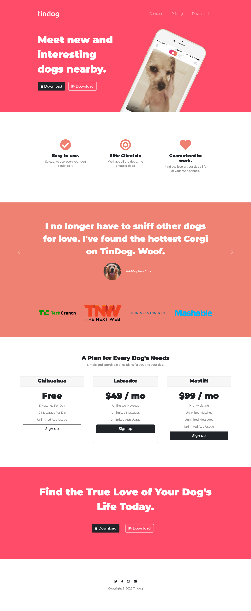
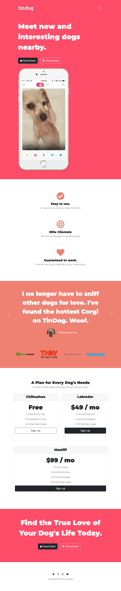

# Tindog Website

This is a challenge done as part of a Udemy course on Web development Bootcamp by Dr. Angela Yu.
Tindog is a website that allows the user to find other dogs & their owners nearby . It is similar to Tinder .

## Table of contents

- [Overview](#overview)
  - [The challenge](#the-challenge)
  - [Screenshot](#screenshot)
- [My process](#my-process)
  - [Built with](#built-with)
- [Links](#links)
- [Author](#author)

## Overview

### The challenge

Users should be able to:

- View the optimal layout for the app depending on their device's screen size
- Navigate to different sections of the website.
- See the hover states.

### Screenshot

#### Desktop Design

#### Mobile Design

### Links

- Live Site URL: [@nees101/Github]( https://nees101.github.io/Tindog/)

## My process

### Built with

- Semantic HTML5 markup
- Bootstrap and CSS custom properties

## Author

- Github - [@nees101](https://www.github.com/nees101)
